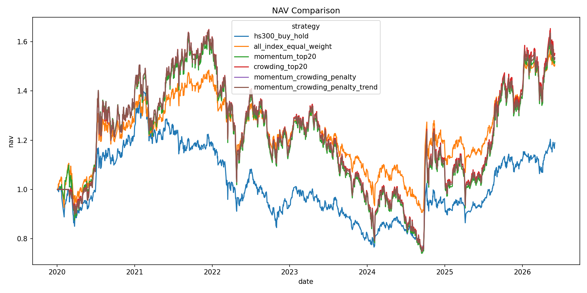
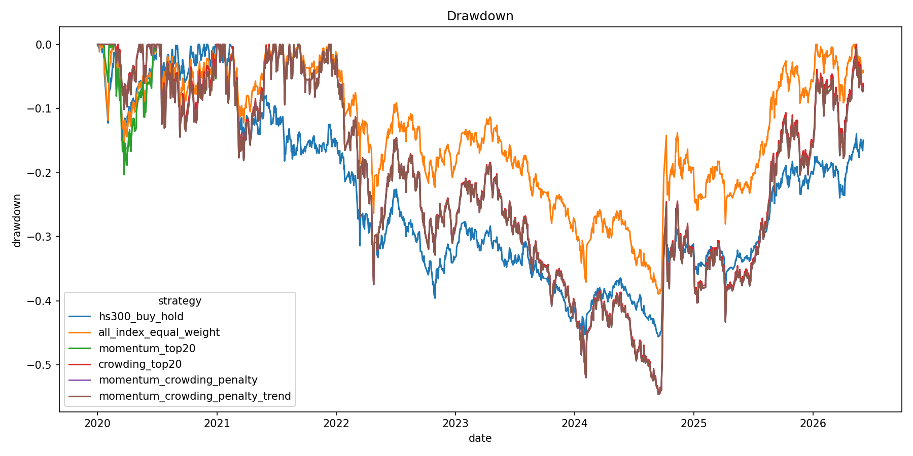

<h1 align="left">交易拥挤度惩罚的动量轮动策略 | Trading-Crowding Penalized Momentum Rotation</h1>

---

<p align="center">
  <a href="#中文说明"></a>
  <a href="#english-description"></a>
</p>

<p align="center">
  
  
  
  
  
</p>

---

## 中文说明

### 项目简介

本项目从零实现一个 A 股指数层面的“交易拥挤度 + 动量轮动”策略研究框架。项目自动读取指数日频行情，构建动量、拥挤度和波动率风险指标，进行每周调仓回测，并输出绩效表格、图表和诊断报告。

核心思想不是把拥挤度直接当作买入 alpha，而是把它作为动量策略的风险惩罚项：优先选择短期动量较强、但交易拥挤度和波动率不过高的指数。

### 结果怎么样

本次真实数据运行覆盖 2020-01-02 至 2026-06-03，共 15 个 A 股代表性指数、23295 条日频记录，数据由 Tushare 成功下载。

| 策略 | 年化收益 | 年化波动 | Sharpe | 最大回撤 | 最终净值 |
|:--|--:|--:|--:|--:|--:|
| 全指数等权 | 6.59% | 20.23% | 0.33 | -38.93% | 1.506 |
| 纯拥挤度 top20 对照组 | 7.10% | 28.34% | 0.25 | -54.30% | 1.553 |
| 沪深300买入持有 | 2.74% | 18.75% | 0.15 | -45.60% | 1.189 |
| 动量 - 拥挤度惩罚 | 6.91% | 28.69% | 0.24 | -54.56% | 1.535 |
| 动量 - 拥挤度惩罚 + 趋势过滤 | 6.91% | 28.69% | 0.24 | -54.56% | 1.535 |
| 纯 5 日动量 top20 | 6.74% | 29.04% | 0.23 | -54.52% | 1.520 |

解读要点：

- 主策略相对纯 5 日动量略有提升，年化收益从 6.74% 提高到 6.91%，波动率也略低。
- 全指数等权组合 Sharpe 更高、回撤更浅，说明这个小指数池里分散化本身很有价值。
- 纯拥挤度 top20 是对照组，不是推荐策略；它年化最高，但逻辑上更接近追逐交易热度，回撤仍然很深。
- 趋势过滤版本与未过滤版本结果相同，说明当前 MA60 过滤规则在该样本和调仓路径下没有提供额外保护。
- 整体最大回撤仍然超过 50%，该项目更适合作为研究框架，而不是直接实盘方案。

### 策略逻辑

默认指数池包括沪深300、中证500、中证1000、创业板指、科创50、红利指数、消费、医药、半导体、新能源、军工、金融、地产、传媒、计算机等代表性指数。

因子定义：

- 动量：`ret_5d = close / close.shift(5) - 1`，`ret_20d = close / close.shift(20) - 1`
- 拥挤度：`turnover_z`、`amount_z`、`volume_z` 的 60 日滚动异常程度
- 波动率风险：`vol_20d = rolling_std(daily_return, 20)`
- 复合拥挤度：`rank(turnover_z) * 0.4 + rank(amount_z) * 0.3 + rank(ret_20d) * 0.3`
- 最终得分：`rank(ret_5d) - 0.5 * rank(crowding_score) - 0.3 * rank(vol_20d)`

所有 rank 均为同一天不同指数之间的横截面 percentile rank，并且所有交易信号滞后一日，避免未来函数。

### 数据来源

数据层优先使用 Tushare Pro：

- `pro_bar` / `index_daily`：指数日行情
- 环境变量：`TUSHARE_TOKEN`
- 失败处理：token 缺失、权限不足或接口异常时自动 fallback 到 AKShare

代码不会把 token 写入源码。AKShare fallback 使用指数历史行情接口，并对中英文字段名做统一映射。

### 安装方式

```bash
pip install -r requirements.txt
```

如使用 Tushare：

```bash
set TUSHARE_TOKEN=your_token
```

### 运行方式

```bash
python run_pipeline.py --config config.yaml
```

### 输出文件

- `data/processed/panel_daily.parquet`：统一后的日频 long-format 数据
- `outputs/tables/factor_values.csv`：因子与滞后信号
- `outputs/tables/portfolio_nav.csv`：各策略净值
- `outputs/tables/weekly_weights.csv`：每周调仓权重
- `outputs/tables/turnover.csv`：换手率与交易成本
- `outputs/tables/performance_summary.csv`：绩效汇总
- `outputs/tables/yearly_returns.csv`：年度收益
- `outputs/tables/monthly_returns.csv`：月度收益
- `outputs/reports/backtest_report.md`：自动生成的回测报告

### 主要图表





更多图表：

- `outputs/figures/yearly_returns.png`
- `outputs/figures/monthly_return_heatmap.png`
- `outputs/figures/holding_count.png`
- `outputs/figures/turnover.png`
- `outputs/figures/factor_ic.png`

### 项目结构

```text
trading-crowding-momentum-strategy/
├── README.md
├── LICENSE
├── requirements.txt
├── config.yaml
├── run_pipeline.py
├── src/
├── data/
├── outputs/
└── tests/
```

### 局限性

- 指数换手率常常不可得，因此拥挤度会使用成交额、成交量异常作为替代。
- 当前指数池只有 15 个标的，横截面宽度有限。
- 交易成本用 3bp 单边成本近似，未建模冲击成本和真实 ETF 可交易性。
- 最大回撤仍然很深，说明该策略需要进一步风控和样本外验证。
- 趋势过滤规则较简单，在当前样本中没有改善结果。

### 后续优化方向

- 扩展行业、主题和 ETF 可交易池。
- 引入 ETF 份额、资金流、融资融券、北向资金等更直接的拥挤度代理变量。
- 对调仓频率、拥挤度窗口、权重上限和趋势过滤规则做样本外验证。
- 加入容量约束、冲击成本模型和真实 ETF 映射。

---

## English Description

### Overview

This project implements a from-scratch A-share index research framework for a trading-crowding penalized momentum rotation strategy. It downloads daily index data, builds momentum, crowding, and volatility-risk signals, runs weekly rebalancing backtests, and exports performance tables, figures, and diagnostics.

The key idea is not to use crowding directly as alpha. Crowding is used as a risk penalty inside a momentum strategy, favoring indices with positive short-term momentum but less excessive trading activity and volatility.

### Results

The latest real-data run covers 2020-01-02 to 2026-06-03, with 15 representative A-share indices and 23295 daily observations downloaded from Tushare.

| Strategy | Annual Return | Annual Vol | Sharpe | Max Drawdown | Final NAV |
|:--|--:|--:|--:|--:|--:|
| All-index equal weight | 6.59% | 20.23% | 0.33 | -38.93% | 1.506 |
| Pure crowding top20 ablation | 7.10% | 28.34% | 0.25 | -54.30% | 1.553 |
| CSI 300 buy and hold | 2.74% | 18.75% | 0.15 | -45.60% | 1.189 |
| Momentum minus crowding penalty | 6.91% | 28.69% | 0.24 | -54.56% | 1.535 |
| Momentum minus crowding penalty plus trend filter | 6.91% | 28.69% | 0.24 | -54.56% | 1.535 |
| Pure 5-day momentum top20 | 6.74% | 29.04% | 0.23 | -54.52% | 1.520 |

Takeaways:

- The main penalized momentum strategy modestly improves over pure 5-day momentum.
- Equal weight has a higher Sharpe and shallower drawdown, showing that diversification is valuable in this small index universe.
- Pure crowding top20 is an ablation, not the recommended strategy. It has the highest annual return but still suffers deep drawdowns.
- The MA60 trend filter did not change results in this run.
- Drawdowns remain large, so this is a research framework rather than a production-ready trading system.

### Strategy Logic

The default universe includes CSI 300, CSI 500, CSI 1000, ChiNext, STAR 50, dividend, consumption, healthcare, semiconductor, new energy, defense, financials, real estate, media, and computer indices.

Signals:

- Momentum: `ret_5d = close / close.shift(5) - 1`, `ret_20d = close / close.shift(20) - 1`
- Crowding proxies: 60-day rolling abnormality in turnover, amount, and volume
- Volatility risk: `vol_20d = rolling_std(daily_return, 20)`
- Composite crowding: `rank(turnover_z) * 0.4 + rank(amount_z) * 0.3 + rank(ret_20d) * 0.3`
- Final score: `rank(ret_5d) - 0.5 * rank(crowding_score) - 0.3 * rank(vol_20d)`

All ranks are same-day cross-sectional percentile ranks. Tradable signals are shifted by one trading day to avoid look-ahead bias.

### Data Sources

The data layer prioritizes Tushare Pro:

- `pro_bar` / `index_daily`: daily index prices
- Environment variable: `TUSHARE_TOKEN`
- Fallback: AKShare when the token is missing, permission is insufficient, or the interface fails

The token is never hard-coded. AKShare fallback normalizes both Chinese and English field names.

### Installation

```bash
pip install -r requirements.txt
```

For Tushare:

```bash
set TUSHARE_TOKEN=your_token
```

### Running

```bash
python run_pipeline.py --config config.yaml
```

### Outputs

- `data/processed/panel_daily.parquet`: normalized long-format daily panel
- `outputs/tables/factor_values.csv`: factor values and lagged signals
- `outputs/tables/portfolio_nav.csv`: strategy NAV series
- `outputs/tables/weekly_weights.csv`: weekly rebalance weights
- `outputs/tables/turnover.csv`: turnover and transaction costs
- `outputs/tables/performance_summary.csv`: performance summary
- `outputs/tables/yearly_returns.csv`: annual returns
- `outputs/tables/monthly_returns.csv`: monthly returns
- `outputs/reports/backtest_report.md`: generated backtest report

### Figures


More figures:

- `outputs/figures/yearly_returns.png`
- `outputs/figures/monthly_return_heatmap.png`
- `outputs/figures/holding_count.png`
- `outputs/figures/turnover.png`
- `outputs/figures/factor_ic.png`

### Limitations

- Index turnover is often unavailable, so traded value and volume abnormality are used as proxies.
- The current universe has only 15 indices, limiting cross-sectional breadth.
- Transaction cost is approximated with 3 bps one-way cost; market impact and ETF tradability are not fully modeled.
- Drawdowns remain deep, so more risk controls and out-of-sample validation are needed.
- The current trend filter is simple and did not improve this sample.

### License

This project is licensed under the MIT License.
