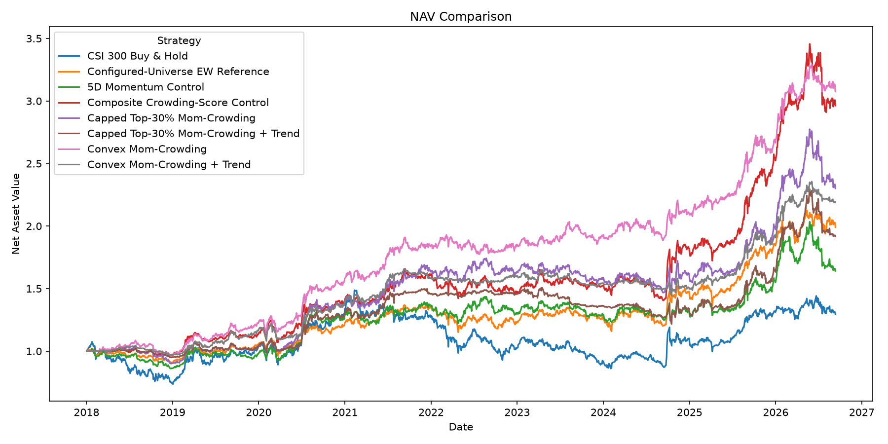
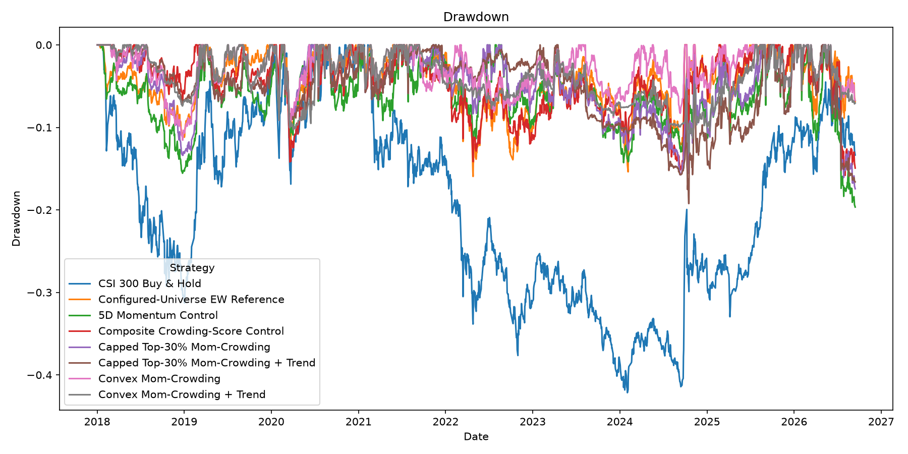
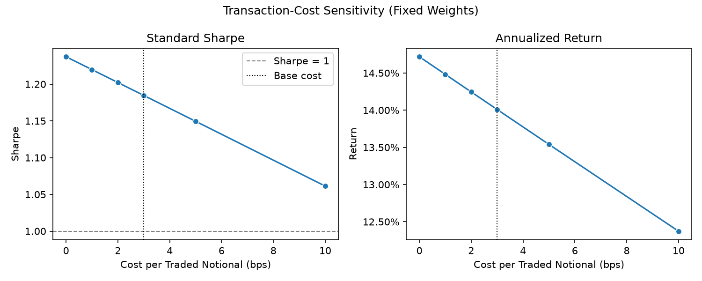

<h1 align="left">拥挤度调整动量与凸组合优化 | Crowding-Aware Momentum with Convex Portfolio Optimization</h1>

---

<p align="center">
  <a href="#中文说明"></a>
  <a href="#english-description"></a>
</p>

<p align="center">
  
  
  
  
  
</p>

<p align="center">
  <strong>Research summary</strong><br>
  An auditable multi-asset listed-fund study of a crowding-adjusted momentum score and how a long-only convex program balances that score against covariance risk and turnover. The repository documents the path from data and allocation failures to a constrained portfolio model, together with the limits of the historical evidence.
</p>

---

## 中文说明

### 研究问题

拥挤度能否帮助区分仍在延续的动量和已经过度集中的交易？信号进入组合层以后，怎样在协方差风险、持仓集中和交易稳定性之间做出可解释的取舍？

本项目使用配置中的 30 只场内基金研究这两个问题，其中包括 29 只 ETF 和 1 只 LOF，各标的按自身可用历史进入样本。前复权日频行情用于构建动量、交易活跃度拥挤代理和波动率控制。信号经过横截面排序并滞后一日，随后进入每周求解的长仓凸优化问题。原有规则保留为参照，用来呈现不同信号与组合配置下的结果差异。

### 项目贡献

| 研究环节 | 具体工作 | 可核验材料 |
|:---|:---|:---|
| 数据可靠性 | 将场内基金行情与复权因子合并，在回测前检查公司行动连续性和异常单日跳变 | [`data_loader.py`](src/data_loader.py)、[`test_data_pipeline.py`](tests/test_data_pipeline.py) |
| 偏差控制 | 交易信号统一滞后一日，协方差只使用信号日及以前的数据 | [`factors.py`](src/factors.py)、[`test_backtest.py`](tests/test_backtest.py) |
| 问题建模 | 将退化的 top-quantile 等权规则改写为带风险项、持仓上限和 L1 换手正则的凸问题 | [`optimizer.py`](src/optimizer.py)、[`test_optimizer.py`](tests/test_optimizer.py) |
| 结果检验 | 保留多组基准，报告单次时间切分、求解诊断和 0 至 10 bps 成本压力情景 | [`backtest_report.md`](outputs/reports/backtest_report.md) |
| 可核验性 | 参数集中在 YAML，主流水线生成表格、图形和报告，独立脚本同步中英文 README，自动化测试核验关键约束 | [`config.yaml`](config.yaml)、[`run_pipeline.py`](run_pipeline.py)、[`update_readme.py`](scripts/update_readme.py)、[`tests`](tests) |

### 研究过程中的关键判断

当 30 个配置标的都有数据时，最初的 top 30% 规则会选出 9 只。旧版 10% 持仓上限把每只入选资产固定在 10%，历史实际总暴露随可用标的数在 60% 至 90% 之间，组合层没有资产间权重自由度。当前实现改为在全部有效资产上连续求权重，并为凸优化器单独设置 15% 上限，使信号得分、协方差风险和换手约束共同影响权重。

原始价格路径中还出现过基金份额合并带来的数量级跳变。如果直接回测，这类公司行动会被误记成策略收益。数据层现在统一使用前复权价格，并在任何绝对单日收益超过 30% 时停止运行并给出标的与日期。

评价口径也经过了拆分。Sharpe 使用日频超额收益的标准定义，CAGR 与波动率之比单独保留。时间稳定性通过配置中的单次时间切分展示，交易成本则在固定信号和目标权重下从 0 bps 压力测试到 10 bps。

当前跟踪结果中，复合拥挤度调整动量得分的一日横截面 Spearman IC 接近零，没有显示稳定预测力，而且这一预测期限与周度调仓并不完全匹配。后续研究需要按周度持有期重新检验复合得分，并加入移除拥挤度惩罚的匹配消融。现有证据更能支持数据纠错、约束建模和验证过程方面的工作。

### 实证结果与证据边界

本次前复权数据运行覆盖 2018-01-02 至 2026-08-28，配置中共有 30 只场内基金，各标的按可用历史进入，合计 54821 条日频记录。

主实验 `momentum_crowding_convex` 在所有信号有效且历史充足的标的上连续求权重，单标的上限为 15%，风险估计使用 120 日收缩协方差。求解状态和历史不足时的确定性回退均记录在输出中，自动报告会列出当前统计。以下数字均为历史回测结果，用于比较研究设计，不代表实盘收益。

文中 Sharpe 采用 `sqrt(252) * mean(daily_return - daily_rf) / std(daily_return)`。默认年化无风险利率为 0%，CAGR 与波动率之比作为独立字段保留。

| 策略 | 年化收益 | 年化波动 | Sharpe | 最大回撤 | 最终净值 |
|:---|---:|---:|---:|---:|---:|
| 全配置资产等权参照 | 8.60% | 12.57% | 0.74 | -15.95% | 2.042 |
| 复合拥挤度得分对照 | 13.64% | 14.43% | 0.99 | -15.82% | 3.022 |
| 沪深300 ETF 买入持有 | 3.31% | 19.63% | 0.27 | -42.16% | 1.325 |
| 凸优化动量 - 拥挤度 | 14.13% | 12.11% | 1.19 | -11.54% | 3.139 |
| 凸优化动量 - 拥挤度 + 趋势过滤 | 9.59% | 10.81% | 0.93 | -13.12% | 2.209 |
| 动量 - 拥挤度 top30 上限等权 | 10.52% | 14.39% | 0.79 | -16.08% | 2.376 |
| 动量 - 拥挤度 top30 上限等权 + 趋势过滤 | 7.95% | 12.78% | 0.69 | -19.23% | 1.938 |
| 5 日动量对照 | 6.19% | 15.00% | 0.49 | -18.36% | 1.681 |

“全配置资产等权参照”每天平均全部配置标的的收益，尚无可用行情的标的按零收益处理，并且没有估算换手和成本。因此它只用于提供粗略的收益参照。

#### 结果解读

<!-- OPTIMIZED_SUMMARY_ZH_START -->
- 主实验「凸优化动量 - 拥挤度」在全样本记录年化 14.13%、标准 Sharpe 1.19、最大回撤 -11.54%，周均 L1 换手为 0.403。
- 在相同信号定义下，旧 top30% 上限等权配置的 Sharpe 为 0.79、最大回撤为 -16.08%；凸优化配置对应 1.19 和 -11.54%。两种配置的资产纳入、持仓上限和实际总暴露均有差异，因此这里只报告观察到的比较。
- 以 2023-01-01 为界进行时间切分，较早区间 Sharpe 为 1.13，较晚区间为 1.28。这个结果用于检查时间稳定性，不代表完全未观察的样本外检验。
- 优化器使用 15% 单标的上限与 750 bp-equivalent 的 L1 换手正则。该系数控制交易稳定性，实际成本假设另按每单位成交名义本金计费。
<!-- OPTIMIZED_SUMMARY_ZH_END -->

### 交易成本敏感性

<!-- COST_SENSITIVITY_ZH_START -->
以下情景保持信号和目标权重不变，仅按计划调仓日的完整 L1 成交名义本金重算成本。

| 每单位成交成本 | 口径 | 年化收益 | 年化波动 | Sharpe | 最大回撤 | 最终净值 |
|---:|:---|---:|---:|---:|---:|---:|
| 0 bps | 情景 | 14.84% | 12.12% | 1.246 | -11.36% | 3.311 |
| 1 bps | 情景 | 14.60% | 12.11% | 1.229 | -11.42% | 3.252 |
| 2 bps | 情景 | 14.37% | 12.11% | 1.211 | -11.48% | 3.195 |
| 3 bps | 基准 | 14.13% | 12.11% | 1.194 | -11.54% | 3.139 |
| 5 bps | 情景 | 13.67% | 12.11% | 1.159 | -11.67% | 3.029 |
| 10 bps | 情景 | 12.50% | 12.10% | 1.071 | -11.98% | 2.771 |
<!-- COST_SENSITIVITY_ZH_END -->

成本率按每单位模拟成交名义本金收取，而换手采用完整 L1 口径 `sum(abs(w_target - w_previous))`。因此从现金建仓至 100% 仓位的换手为 1，从一个满仓组合完全切换到另一个满仓组合的换手为 2，后者会同时计入卖出和买入两侧成本。3 bps 仅为基准回测假设，不能视作券商佣金报价，也不同于优化器的 750 bp-equivalent 换手正则。

### 策略逻辑

默认资产池包含 30 只场内基金，覆盖债券、A 股宽基与行业、跨境权益和商品。完整标的与数据参数集中在 [`config.yaml`](config.yaml)，便于复核和替换。

因子定义

- **动量** `ret_5d = close / close.shift(5) - 1`，`ret_20d = close / close.shift(20) - 1`
- **拥挤度输入** 换手率和成交额的 60 日滚动异常程度，成交量仅在前两者缺失时回退使用
- **波动率控制** `vol_20d = rolling_std(daily_return, 20)`
- **复合拥挤度** `0.4 * turnover_rank + 0.3 * amount_rank + 0.3 * rank(ret_20d)`，前两项按上述回退规则补值
- **最终得分** `1.0 * rank(ret_5d) + 1.0 * rank(ret_20d) - 0.65 * rank(crowding_score) - 0.1 * rank(vol_20d)`

所有 rank 均为同一天不同指数之间的横截面 percentile rank，并且所有交易信号滞后一日，避免未来函数。

### 凸优化组合构建

主实验 `momentum_crowding_convex` 不做硬 top-k 筛选，在所有信号有效且历史长度足够的标的上连续求权重。30 个配置标的都可用时，旧 top30% 规则选择 9 只，配合 10% 上限会强制每只都是 10%；可用横截面较小时选择 6 至 8 只并保留更多现金暴露。凸优化器使用独立的 15% 上限，让 alpha、风险和换手共同影响权重。

当前主实验在每个调仓日求解以下凸二次规划。

```text
minimize  -alpha' w
          + (risk_aversion / 2) * w' Sigma w
          + turnover_penalty * ||w - w_prev||_1

subject to  sum(w) = target_exposure
            0 <= w_i <= max_weight
```

- `alpha` 是横截面标准化后的滞后综合得分，保留“动量减拥挤度”的经济含义。
- `Sigma` 只使用信号日及以前的滚动收益估计，并经过对角收缩和特征值下限处理，保证数值上半正定。
- 默认 750 bp-equivalent 的 L1 系数用于控制换手稳定性，交易费另按每单位成交名义本金 3 bps 扣除。
- 代码还支持拥挤集中惩罚、现金、硬换手上限和事前波动率上限。当前配置关闭这些扩展项，因此它们没有写入上面的主实验公式。
- 当有效资产不足时，目标暴露自动取 `min(exposure, n_valid * max_weight)`；求解失败时确定性回退到原等权选择器，并在 `turnover.csv` 留下状态。

参数集中在 `strategy.convex_optimizer`。`turnover.csv` 同时输出求解状态、目标暴露、目标函数分解、事前波动率和迭代次数，便于区分 alpha、风险、拥挤度和换手成本的贡献。

### 数据来源

数据层优先使用 Tushare Pro 的基金行情与复权因子。

- `fund_daily + fund_adj` 生成连续的前复权场内基金 OHLC，避免把拆分和份额合并记作收益
- 环境变量使用 `TUSHARE_TOKEN`
- token 缺失、复权因子权限不足或接口异常时，程序回退到 AKShare `fund_etf_hist_em(adjust="qfq")`
- 质量门槛默认拒绝绝对值超过 30% 的场内基金单日收益，并输出具体日期和标的

代码不会把 token 写入源码。当前跟踪数据已通过配置中的复权连续性和极端收益门槛检查。
AKShare 对复权必要性和 `qfq` 参数的说明见其[官方 ETF 行情文档](https://akshare.akfamily.xyz/data/fund/fund_public.html)。

### 安装方式

```bash
pip install -r requirements.txt
```

使用 Tushare 时设置环境变量。

```bash
set TUSHARE_TOKEN=your_token
```

### 运行方式

```bash
python run_pipeline.py --config config.yaml
```

### 输出文件

- `data/processed/panel_daily.parquet` 统一后的日频 long-format 数据
- `outputs/tables/factor_values.csv` 因子与滞后信号
- `outputs/tables/portfolio_nav.csv` 各策略净值
- `outputs/tables/weekly_weights.csv` 每周调仓权重
- `outputs/tables/turnover.csv` 完整 L1 换手、交易成本、求解状态、目标函数分解、事前波动率和约束松弛量
- `outputs/tables/performance_summary.csv` 绩效汇总
- `outputs/tables/transaction_cost_sensitivity.csv` 固定信号和目标权重下的交易成本敏感性
- `outputs/tables/yearly_returns.csv` 年度收益
- `outputs/tables/monthly_returns.csv` 月度收益
- `outputs/reports/backtest_report.md` 自动生成的回测报告

### 主要图表







补充图表

- `outputs/figures/yearly_returns.png`
- `outputs/figures/monthly_return_heatmap.png`
- `outputs/figures/holding_count.png`
- `outputs/figures/turnover.png`
- `outputs/figures/transaction_cost_sensitivity.png`
- `outputs/figures/factor_ic.png`

### 项目结构

```text
trading-crowding-momentum-strategy/
├── README.md
├── LICENSE
├── requirements.txt
├── config.yaml
├── run_pipeline.py
├── src/
│   ├── data_loader.py
│   ├── data_cleaner.py
│   ├── factors.py
│   ├── optimizer.py
│   ├── backtest.py
│   ├── performance.py
│   ├── plotting.py
│   └── strategy_metadata.py
├── scripts/update_readme.py
├── data/
├── outputs/
└── tests/
```

### 局限性

- 资产池由当前配置手工给出，尚未按历史时点重建场内基金的上市、退市和可交易状态，选择偏差与幸存者偏差仍可能存在。
- 换手率、成交额和成交量都属于间接拥挤度输入。当前接近零的日频横截面 IC 也说明复合得分证据仍弱。
- 当前没有在同一优化器和约束下移除拥挤度惩罚的匹配消融，因此结果无法识别拥挤度的边际贡献。
- 配置中的单次时间切分只是一项描述性诊断。仓库尚未记录冻结参数的事前流程，也没有重复 walk-forward 或多重检验校正。
- 基准成本为每单位成交名义本金 3 bps；0/1/2/3/5/10 bps 情景只重算计划调仓成本，尚未用逐笔盘口数据建模价差、冲击和容量。
- 当前向量化回测把目标权重视为调仓间的固定日度暴露，并按计划目标权重变化计费；这一口径与持仓份额自然漂移后的逐笔成交模拟存在差异。
- 750 bp-equivalent 是基于历史稳定性选择的换手正则，不应解释为可观测的真实交易成本。
- 历史 Sharpe 来自规模有限且资产异质的样本，无法推出相近的未来实盘表现。

### 后续优化方向

- 按历史时点重建场内基金可交易池，并记录每次参数冻结与模型选择过程。
- 引入基金份额、资金流和融资数据，重新检验拥挤度假设。
- 增加滚动 walk-forward、参数漂移监控和多重检验校正。
- 改用持仓份额自然漂移的执行模拟，并加入容量、价差和冲击成本。

---

## English Description

### Research Question

Can crowding information help distinguish persistent momentum from concentrated trades? Once a signal reaches the portfolio layer, how should covariance risk, concentration, and trading stability be balanced in an interpretable way?

This repository studies those questions with 30 configured listed funds, comprising 29 ETFs and one LOF, each entering over its available history. Forward-adjusted daily prices support momentum, trading-activity crowding inputs, and a volatility control. Signals are ranked cross-sectionally and lagged by one trading day before entering a weekly long-only convex program. Earlier rules remain as reference points for comparing outcomes across signal and portfolio configurations.

### What This Project Demonstrates

| Research Area | Work Completed | Verifiable Evidence |
|:---|:---|:---|
| Data integrity | Combined listed-fund prices with adjustment factors and added corporate-action continuity and extreme-return checks before backtesting | [`data_loader.py`](src/data_loader.py), [`test_data_pipeline.py`](tests/test_data_pipeline.py) |
| Bias control | Lagged tradable signals by one day and restricted covariance inputs to information available by each signal date | [`factors.py`](src/factors.py), [`test_backtest.py`](tests/test_backtest.py) |
| Problem formulation | Replaced a constrained top-quantile rule with a convex program combining covariance risk and L1 turnover regularization under position limits | [`optimizer.py`](src/optimizer.py), [`test_optimizer.py`](tests/test_optimizer.py) |
| Evaluation | Retained multiple baselines and reported a single chronological split, solver diagnostics, and fixed-target cost stress from 0 to 10 bps | [`backtest_report.md`](outputs/reports/backtest_report.md) |
| Auditability | Centralized parameters in YAML; the main pipeline generates tables, figures, and reports, a separate updater synchronizes the bilingual README, and tests verify key constraints | [`config.yaml`](config.yaml), [`run_pipeline.py`](run_pipeline.py), [`update_readme.py`](scripts/update_readme.py), [`tests`](tests) |

### Research Decisions

Once all 30 configured instruments are available, the first top-30% rule selects nine. Its 10% cap fixes every selected weight at 10%; across the tracked history, the resulting exposure ranges from 60% to 90% as the available cross-section changes. The current formulation optimizes continuous weights across all eligible instruments under a separate 15% cap, allowing the signal score, covariance risk, and turnover to affect the solution.

Raw price paths also exposed unit-consolidation jumps that would have entered the backtest as false returns. The data layer now uses forward-adjusted prices and stops with the affected symbol and date whenever an absolute daily move exceeds 30%.

The evaluation separates the standard daily excess-return Sharpe from the CAGR-to-volatility ratio. The configured split describes earlier and later behavior, while fixed-signal transaction-cost scenarios range from 0 to 10 bps. The one-day cross-sectional Spearman IC of the composite crowding-adjusted momentum score is near zero and does not show stable predictability. That horizon also differs from the weekly rebalance interval, so a holding-period-aligned IC test and a matched no-crowding ablation remain future work. The present evidence is strongest on data controls, constrained portfolio construction, and research auditability.

### Empirical Results and Evidence Boundary

The latest forward-adjusted run covers 2018-01-02 to 2026-08-28 and contains 54821 daily observations across 30 configured listed funds over their available histories.

The main `momentum_crowding_convex` experiment optimizes across every instrument with a valid signal and sufficient history. It uses a 15% single-instrument cap and a 120-day shrunk covariance estimate. Solver states and deterministic insufficient-history fallbacks are recorded in the outputs, and the generated report gives the current counts. Every figure below comes from a historical backtest and supports comparison within this research design; it does not represent live performance.

Sharpe uses `sqrt(252) * mean(daily_return - daily_rf) / std(daily_return)`. The default annual risk-free rate is 0%. CAGR divided by volatility remains a separate output field.

| Strategy | Annual Return | Annual Vol | Sharpe | Max Drawdown | Final NAV |
|:---|---:|---:|---:|---:|---:|
| Configured-Universe EW Reference | 8.60% | 12.57% | 0.74 | -15.95% | 2.042 |
| Composite Crowding-Score Control | 13.64% | 14.43% | 0.99 | -15.82% | 3.022 |
| CSI 300 Buy & Hold | 3.31% | 19.63% | 0.27 | -42.16% | 1.325 |
| Convex Mom-Crowding | 14.13% | 12.11% | 1.19 | -11.54% | 3.139 |
| Convex Mom-Crowding + Trend | 9.59% | 10.81% | 0.93 | -13.12% | 2.209 |
| Capped Top-30% Mom-Crowding | 10.52% | 14.39% | 0.79 | -16.08% | 2.376 |
| Capped Top-30% Mom-Crowding + Trend | 7.95% | 12.78% | 0.69 | -19.23% | 1.938 |
| 5D Momentum Control | 6.19% | 15.00% | 0.49 | -18.36% | 1.681 |

The Configured-Universe EW Reference averages returns across all configured slots each day, fills unavailable returns with zero, and does not estimate turnover or costs. It is included only as a rough return reference.

#### Results Interpretation

<!-- OPTIMIZED_SUMMARY_EN_START -->
- The main Convex Mom-Crowding experiment records 14.13% annualized return, a standard Sharpe of 1.19, -11.54% max drawdown, and 0.403 average weekly L1 turnover over the full sample.
- Under the same signal definition, the legacy capped top-30% configuration records Sharpe of 0.79 and max drawdown of -16.08%; the convex configuration records 1.19 and -11.54%. Eligible assets, position caps, and resulting exposure also differ, so the comparison does not isolate a causal effect.
- A 2023-01-01 temporal split reports Sharpe of 1.13 in the earlier segment and 1.28 in the later segment. This stability diagnostic does not establish a fully untouched out-of-sample test.
- The optimizer uses a 15% single-instrument cap and 750 bp-equivalent L1 turnover regularizer. Realized transaction costs are modeled separately per unit of traded notional.
<!-- OPTIMIZED_SUMMARY_EN_END -->

### Transaction-Cost Sensitivity

<!-- COST_SENSITIVITY_EN_START -->
These scenarios hold signals and target weights fixed and only reprice gross L1 traded notional on scheduled rebalance dates.

| Cost per Traded Notional | Case | Annual Return | Annual Vol | Sharpe | Max Drawdown | Final NAV |
|---:|:---|---:|---:|---:|---:|---:|
| 0 bps | Scenario | 14.84% | 12.12% | 1.246 | -11.36% | 3.311 |
| 1 bps | Scenario | 14.60% | 12.11% | 1.229 | -11.42% | 3.252 |
| 2 bps | Scenario | 14.37% | 12.11% | 1.211 | -11.48% | 3.195 |
| 3 bps | Base | 14.13% | 12.11% | 1.194 | -11.54% | 3.139 |
| 5 bps | Scenario | 13.67% | 12.11% | 1.159 | -11.67% | 3.029 |
| 10 bps | Scenario | 12.50% | 12.10% | 1.071 | -11.98% | 2.771 |
<!-- COST_SENSITIVITY_EN_END -->

The rate is charged per unit of traded notional, while turnover uses the full L1 definition `sum(abs(w_target - w_previous))`. Moving from cash to a fully invested portfolio has turnover 1; completely replacing one fully invested portfolio with another has turnover 2 and charges both sell and buy legs. The 3 bps base case is a backtest assumption, not a broker quote, and is separate from the optimizer's 750 bp-equivalent turnover regularizer.

### Strategy Logic

The default universe contains 30 listed funds across bonds, mainland and cross-border equities, commodities, and cash-like exposures. The complete symbol list and data parameters are recorded in [`config.yaml`](config.yaml).

Signal definitions

- **Momentum** `ret_5d = close / close.shift(5) - 1`, `ret_20d = close / close.shift(20) - 1`
- **Crowding inputs** 60-day rolling abnormality in turnover and traded amount, with volume used only as a missing-data fallback
- **Volatility control** `vol_20d = rolling_std(daily_return, 20)`
- **Composite crowding** `0.4 * turnover_rank + 0.3 * amount_rank + 0.3 * rank(ret_20d)`, using the fallback rule above for the first two terms
- **Final score** `1.0 * rank(ret_5d) + 1.0 * rank(ret_20d) - 0.65 * rank(crowding_score) - 0.1 * rank(vol_20d)`

All ranks are same-day cross-sectional percentile ranks. Tradable signals are shifted by one trading day to avoid look-ahead bias.

### Convex Portfolio Construction

The main `momentum_crowding_convex` experiment solves for continuous weights over all instruments with valid signals and sufficient trailing history. When all 30 configured instruments are available, the legacy top-30% screen selects nine and its 10% cap fixes every selected weight at 10%; smaller available cross-sections hold six to eight names and retain more cash exposure. The convex experiment uses a separate 15% cap.

The active main experiment solves the following convex quadratic program at each rebalance.

```text
minimize  -alpha' w
          + (risk_aversion / 2) * w' Sigma w
          + turnover_penalty * ||w - w_prev||_1

subject to  sum(w) = target_exposure
            0 <= w_i <= max_weight
```

`alpha` is the standardized lagged crowding-adjusted momentum score. `Sigma` uses only trailing returns available
on the signal date and is made numerically positive semidefinite through diagonal shrinkage and an eigenvalue floor.
The 750 bp-equivalent L1 coefficient is a stability regularizer, not the realized fee assumption; the base backtest charges
3 bps per unit of traded notional. The implementation also supports a separate crowding-concentration penalty, cash, a hard turnover limit, and an ex-ante volatility limit. The tracked configuration disables those extensions, so they are omitted from the active formula above. Capacity is handled with
`min(exposure, n_valid * max_weight)`, and deterministic fallbacks plus objective diagnostics are recorded in `turnover.csv`.

### Data Sources

The data layer prioritizes adjusted Tushare fund data.

- **Primary path** `fund_daily + fund_adj` produces continuous forward-adjusted listed-fund OHLC
- **Environment variable** `TUSHARE_TOKEN`
- **Fallback** AKShare `fund_etf_hist_em(adjust="qfq")`
- **Quality gate** rejects unexplained absolute daily listed-fund returns above 30%

The token is never hard-coded. The tracked panel passes the configured adjusted-price continuity and extreme-return gates.
See the [official AKShare ETF history documentation](https://akshare.akfamily.xyz/data/fund/fund_public.html) for why adjusted prices are required and how `qfq` is requested.

### Installation

```bash
pip install -r requirements.txt
```

Set the following environment variable when using Tushare.

```bash
set TUSHARE_TOKEN=your_token
```

### Running

```bash
python run_pipeline.py --config config.yaml
```

### Outputs

- `data/processed/panel_daily.parquet` normalized long-format daily panel
- `outputs/tables/factor_values.csv` factor values and lagged signals
- `outputs/tables/portfolio_nav.csv` strategy NAV series
- `outputs/tables/weekly_weights.csv` weekly rebalance weights
- `outputs/tables/turnover.csv` gross L1 turnover, costs, solver status, objective components, ex-ante volatility, and constraint slack
- `outputs/tables/performance_summary.csv` performance summary
- `outputs/tables/transaction_cost_sensitivity.csv` fixed-signal, fixed-target transaction-cost scenarios
- `outputs/tables/yearly_returns.csv` annual returns
- `outputs/tables/monthly_returns.csv` monthly returns
- `outputs/reports/backtest_report.md` generated backtest report

### Figures


Additional figures

- `outputs/figures/yearly_returns.png`
- `outputs/figures/monthly_return_heatmap.png`
- `outputs/figures/holding_count.png`
- `outputs/figures/turnover.png`
- `outputs/figures/transaction_cost_sensitivity.png`
- `outputs/figures/factor_ic.png`

### Limitations

- The universe is manually specified from the current configuration. Historical listings, delistings, and point-in-time tradability are not reconstructed, so selection and survivorship effects may remain.
- Turnover, traded amount, and fallback volume are indirect crowding inputs. The near-zero daily cross-sectional IC also leaves weak evidence for the composite score.
- No matched experiment removes the crowding penalty while holding the optimizer and constraints fixed, so the current results do not identify crowding's marginal contribution.
- The configured single time split is descriptive. The repository does not record a pre-committed parameter freeze, repeated walk-forward estimation, or multiple-testing adjustment.
- The base cost is 3 bps per unit of traded notional. The 0/1/2/3/5/10 bps scenarios only reprice scheduled target changes; bid-ask spread, market impact, and capacity are not estimated from order-book data.
- The vectorized backtest treats target weights as constant daily exposures between scheduled changes and charges changes in target weights; it is not a drift-aware share-level execution simulation.
- The 750 bp-equivalent turnover coefficient is a historical regularization choice, not an observable trading fee.
- Historical Sharpe ratios from a limited and heterogeneous sample do not imply comparable live performance.

### License

This project is licensed under the MIT License.
